# springboot+Swagger+Knife4j+springmvc

## 前言
本项目由作者独立完成，旨在简化从MySQL数据库表生成Java实体类的过程。
虽然代码结构和注释可能相对较少，但欢迎大家贡献代码！可以新建分支进行修改。

特点
数据库连接：连接MySQL，生成相应的Java实体类。
可选的Redis集成：虽然连接Redis并非必要，但为了使用Jedis，暂时包含了Redis连接。如果需要，可以将其替换为全局Map数据结构。
实体生成：自动生成实体类属性，支持驼峰命名（可在代码中配置）。
多表支持：允许同时读取多个表，生成多个模块的增删改查和分页功能。
目录自动打开：生成Java文件后，自动打开存放文件的目录。
项目状态
目前项目仅包含后端代码。用户可以在控制台输入所需的表名来生成实体类。如果能增加一个美观的前端界面，将会更完美。

未来方向
本项目使用Swagger进行API文档的生成。未来的改进计划是扩展功能，自动生成各种API接口文档，真正帮助程序员高效解决增删改查的问题。

## JDK版本 
openJDK17
## 数据库
MySQL8.0.x
## 开发工具 
IDEA（勿使用2023相关版本）
## Redis版本
Redis6.2.7
## 配置文件
[controller.java.ftl](src%2Fmain%2Fresources%2Ftemplates%2Fcontroller.java.ftl)生成Controller层模板
[DTO.java.ftl](src%2Fmain%2Fresources%2Ftemplates%2FDTO.java.ftl)生成DTO层模板
[entity.java.ftl](src%2Fmain%2Fresources%2Ftemplates%2Fentity.java.ftl)生成实体类模板
[mapper.java.ftl](src%2Fmain%2Fresources%2Ftemplates%2Fmapper.java.ftl)生成mapper层模板
[service.java.ftl](src%2Fmain%2Fresources%2Ftemplates%2Fservice.java.ftl)生成接口层模板
[serviceImpl.java.ftl](src%2Fmain%2Fresources%2Ftemplates%2FserviceImpl.java.ftl)生成接口层实现层模板
[vo.java.ftl](src%2Fmain%2Fresources%2Ftemplates%2Fvo.java.ftl)生成响应类模板
## 模板说明
根据项目的结构需求，生成各层所需的Java文件。每个类中的注解可能因项目而异，请根据实际情况自行修改。


### 项目结构

└─src
└─main
├─java
│  └─com
│      ├─shanjupay
│      │  └─generator
│      │          AutoGenerator.java 原始的模板生成器
│      │          MyBatisPlusGenerator.java 模板生成器
│      │          MybatisPlusGenerator2Main.java 生成模板代码的主要入口在这里
│      │          MybatisPlusGeneratorAddDTO.java 新增DTO的模板配置
│      │          MybatisPlusGeneratorPageDTO.java 分页DTO模板配置
│      │          MybatisPlusGeneratorUpdateDTO.java 更新DTO模板配置
│      │          MybatisPlusGeneratorVo.java 返回体VO模板配置
│      │
│      └─smt
└─resources
├─mapper
├─MATE-INF
│      MENITEST.MF
│
└─templates
controller.java.ftl 请求处理器的模板
DTO.java.ftl dto的模板
entity.java.ftl 实体类的模板
mapper.java.ftl mapper的模板
service.java.ftl 服务层的模板
serviceImpl.java.ftl 服务实现层的模板
vo.java.ftl 响应体的模板

## 使用示例
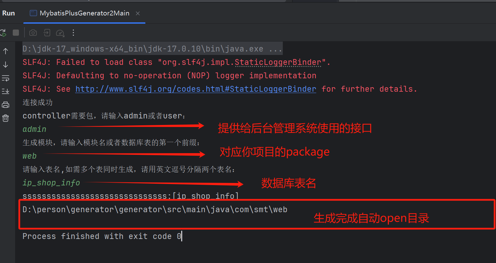

## 目录结构
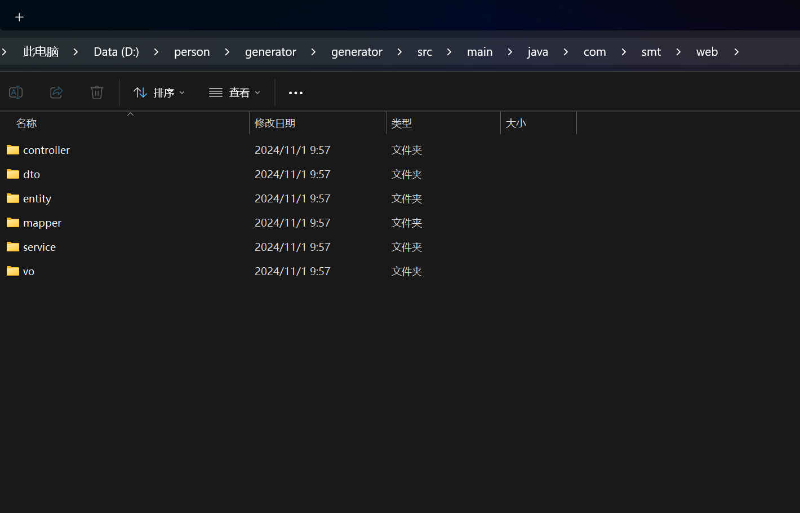

## 小程序端接口示意图
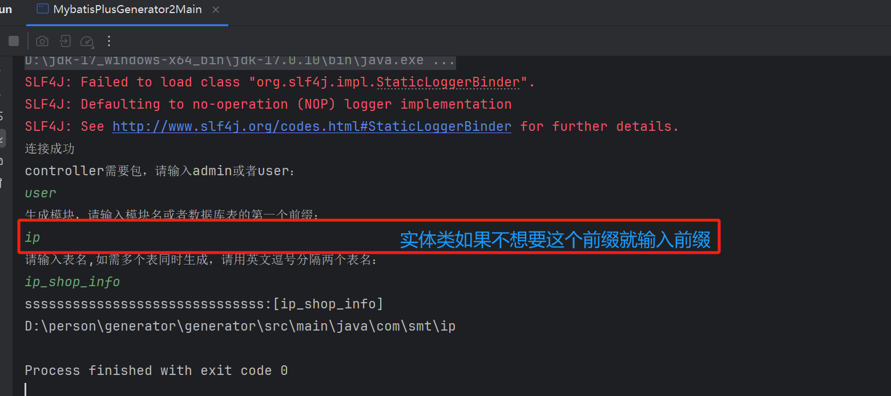

## 生成的文件可以一次性复制全部导入项目
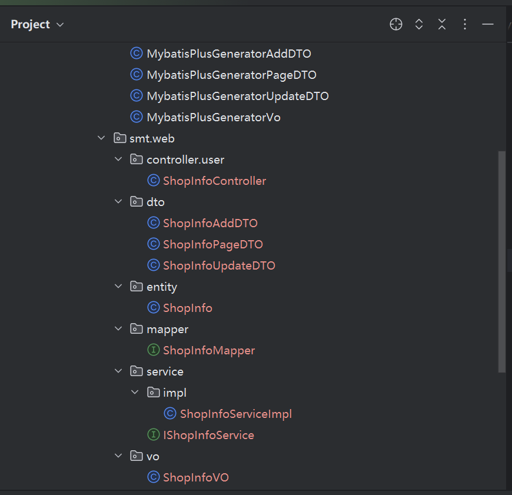
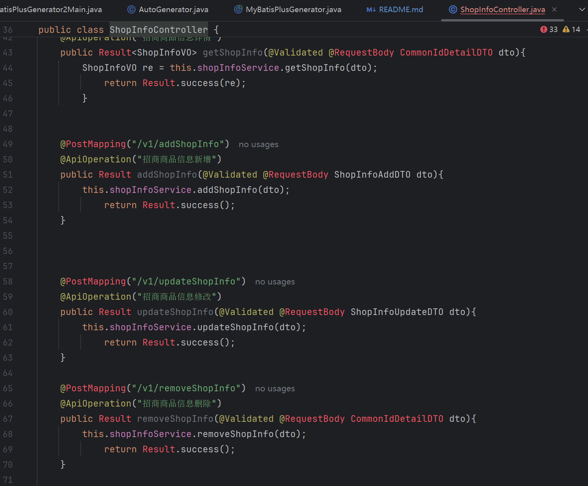
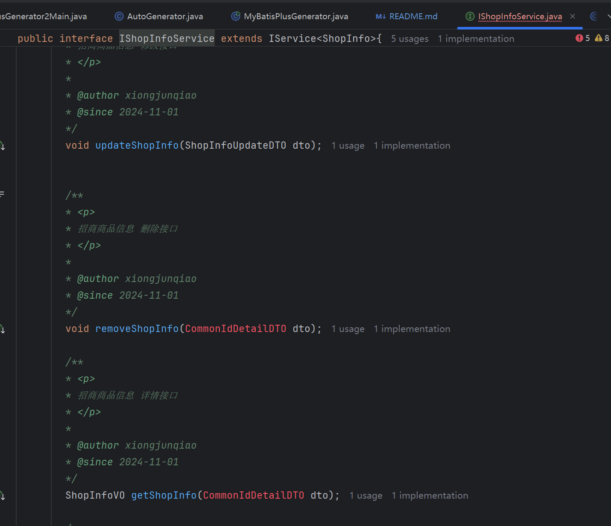
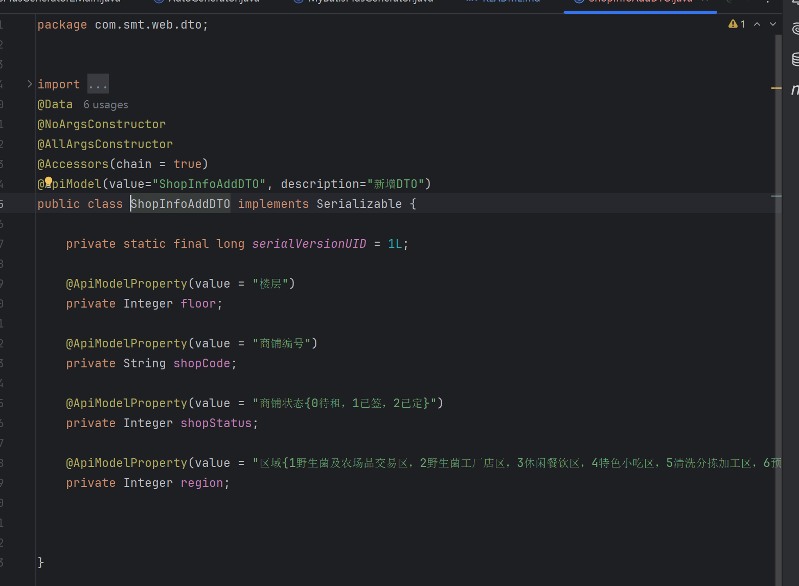
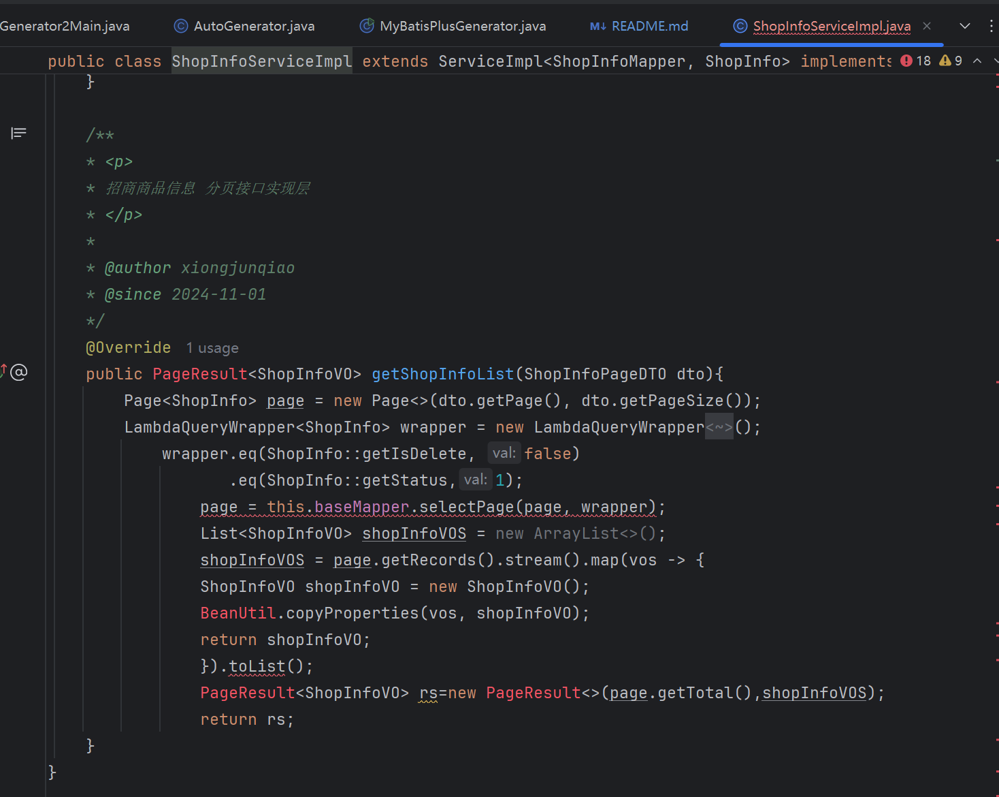
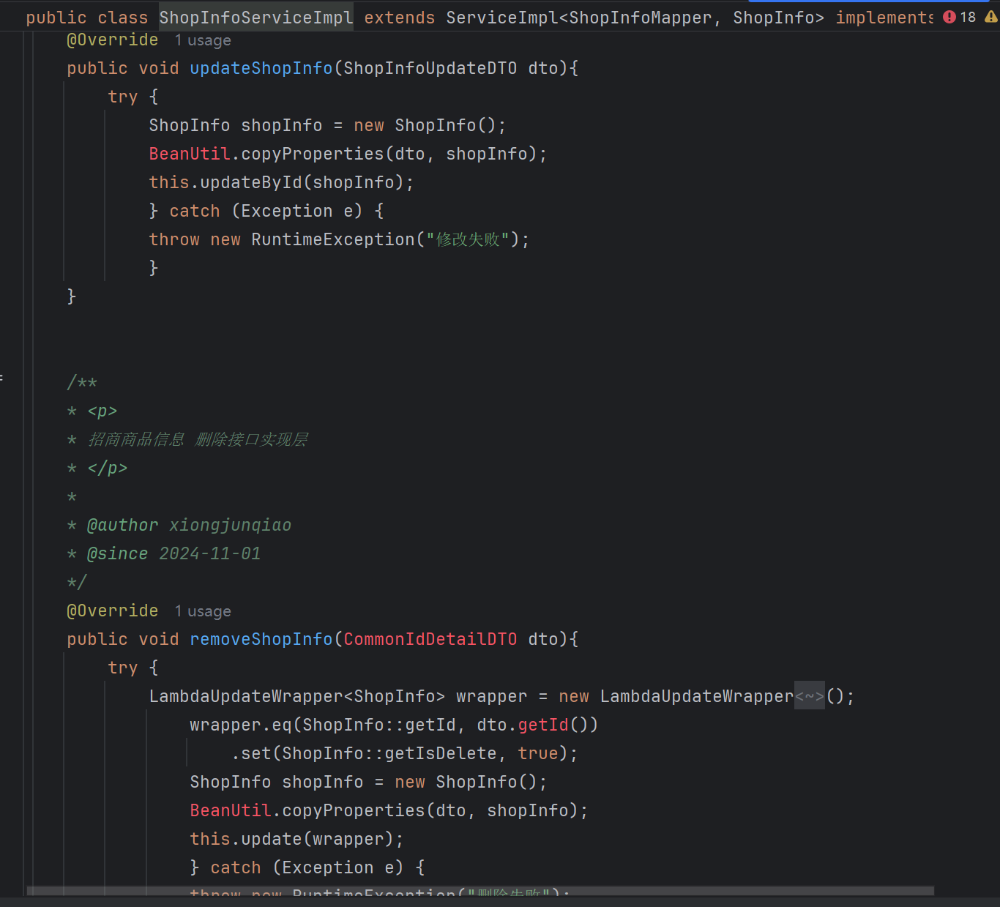
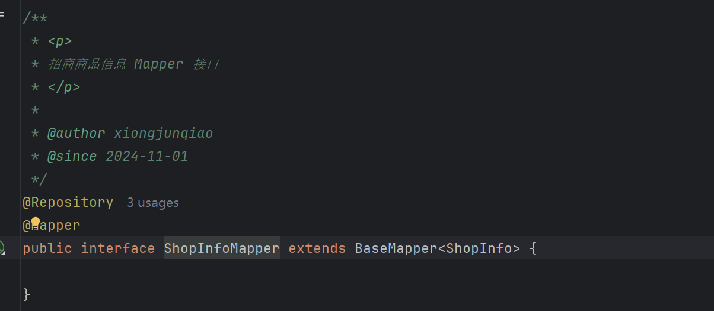
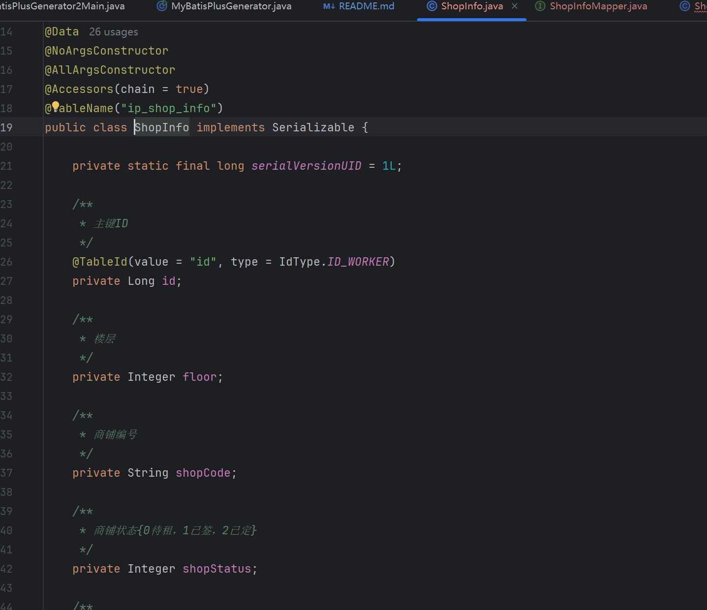
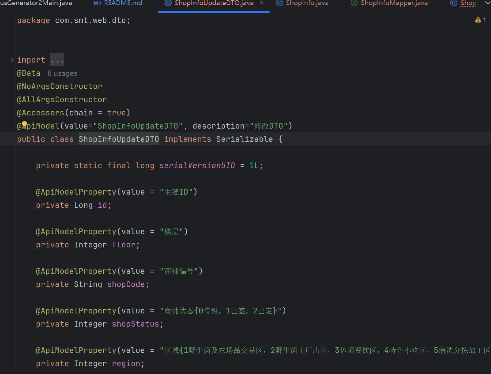
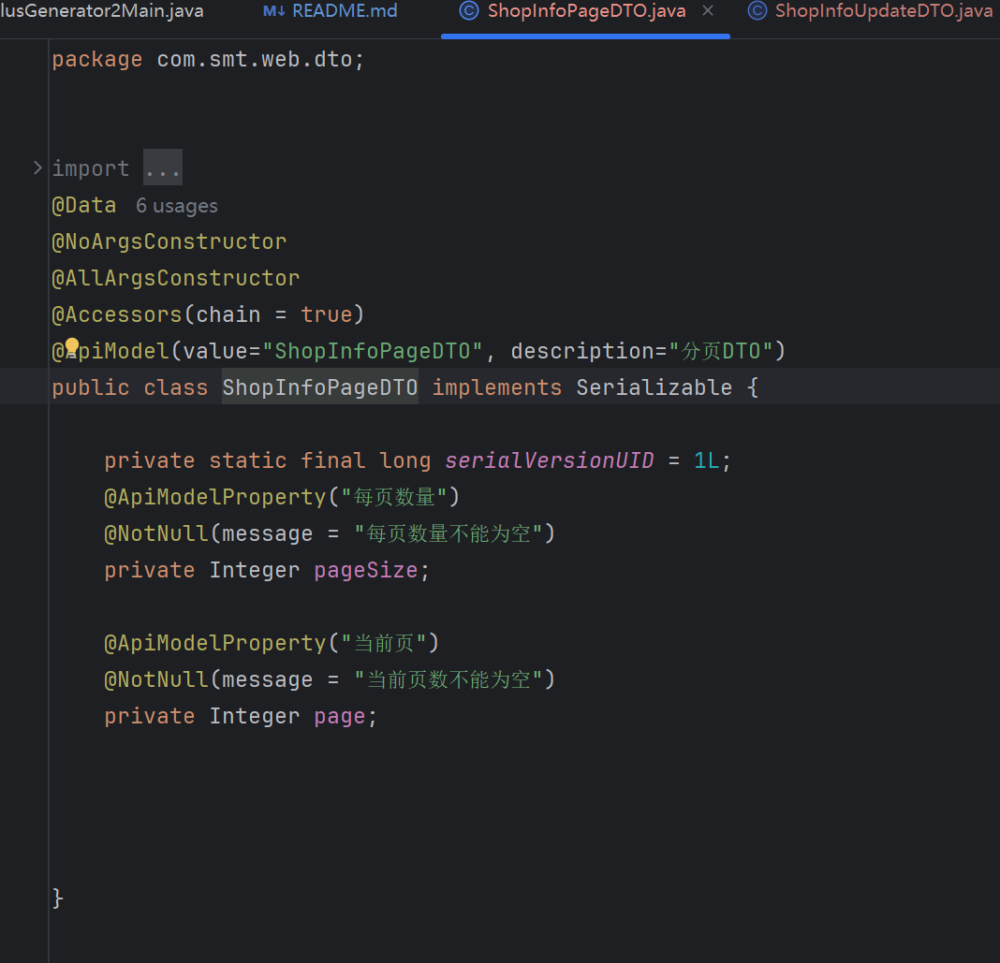

以上全部生成内容皆是可以根据各自项目情况进行修改的，包括package，实体类的主键策略，Swagger注解等等。

```
## 数据库建表规范
### 表名规约

| 模块名称 | 表前缀 |
| -------- | ------ |
| 系统管理 | sys_   |
| 前端用户 | fe_    |
| 自产证明 | sp_    |
| 订单模块 | oms_   |
| 商品模块 | e_     |

### 字段规约

1. 主键字段使用bigint(32),使用雪花算法生成
2. 时间字段统一使用datetime，创建时间默认值 CURRENT_TIMESTAMP,更新时间默认值 CURRENT_TIMESTAMP ON UPDATE CURRENT_TIMESTAMP
3. 是否删除 is_delete 使用 bit(1) 0未删除，1 删除
4. 表一律不适用外键
5. 文件存储采用varchar存储路径，不存储byte数据或base64字符串
6. 日期时间类型，后缀统一为time


## 接口基本规则：
    统一驼峰定义，一样的功能统一前缀路由
    增加用户 addUser
    获取（搜索/筛选）用户列表 getUserList
    删除用户 removeUser
    编辑用户 updateUser
    获取用户详情 getUserDetail
    审核接口 checkUser
    注册 register
    登陆 login
## 数据库公共字段规范
    id 主键
    create_time 创建时间(实体类相应字段必须添加注解：@TableField(fill = FieldFill.INSERT))
    update_time 更新时间(实体类相应字段必须添加注解：@TableField(fill = FieldFill.INSERT_UPDATE))
    create_user_id 创建人(实体类相应字段必须添加注解：@TableField(fill = FieldFill.INSERT))
    update_user_id 更新人(实体类相应字段必须添加注解：@TableField(fill = FieldFill.INSERT_UPDATE))
    is_delete 是否删除(实体类相应字段必须添加注解：@TableField(fill = FieldFill.INSERT))只允许假删除，不允许物理删除，中间表不需要添加该字段
    status 状态
    remark 备注

### 技术选型

#### 后端技术

### git代码提交规范
提交类型（Type）：这是必填项，用于说明提交的类型。常见的提交类型包括：

`feat`：表示新功能。
`fix`：表示修复bug。
`docs`：表示文档修改。
`style`：表示代码格式修改，如缩进、空格等。
`refactor`：表示代码重构。
`test`：表示测试相关修改。
`chore`：表示其他修改，如构建流程、辅助工具等。


